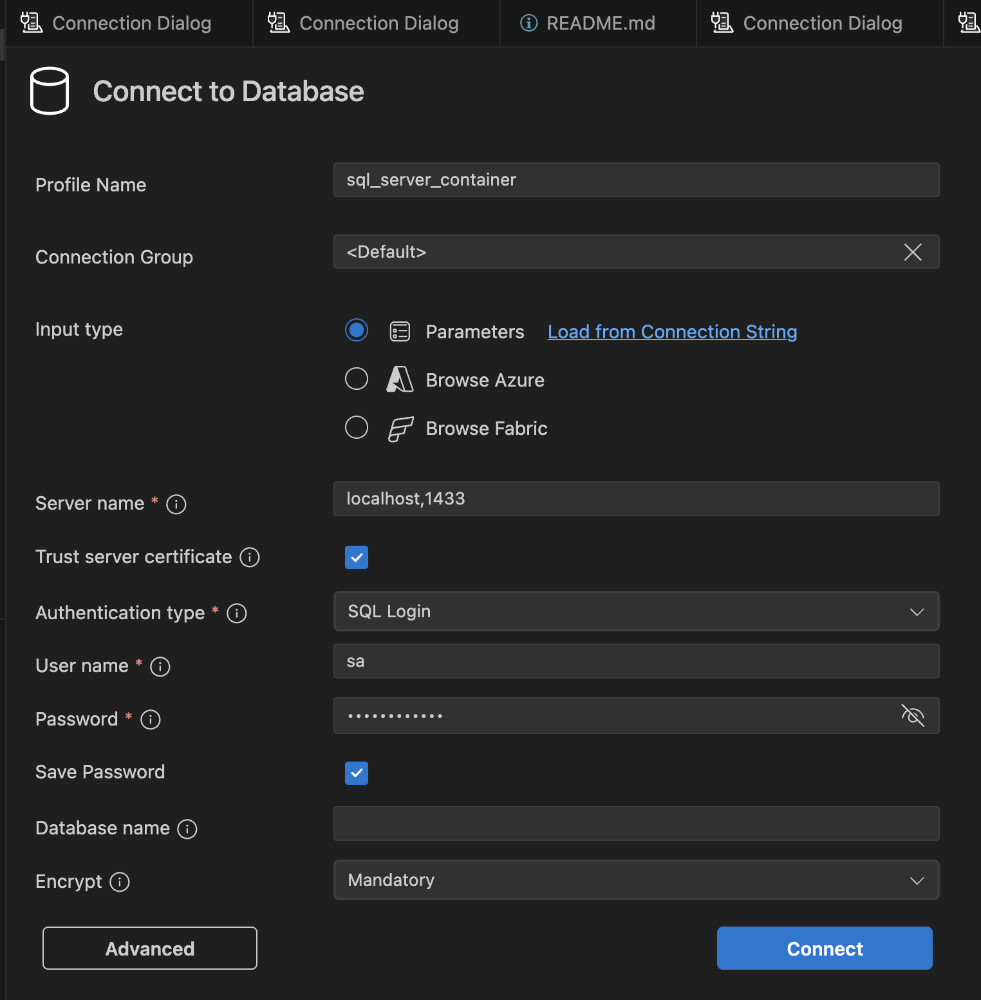

# Setup SQL Server with docker on vscode
[sqlserver+docker](https://youtu.be/JwChEzHTuN8)

    vscode extension: ms-mssql.mssql

## Other resources for ARM/MacOS
[Development with SQL in containers on macOS](https://devblogs.microsoft.com/azure-sql/development-with-sql-in-containers-on-macos/)


## Connection settings when contaniner alreay created

Server name can point to another machine,

eg: 102.168.1.10,1433



## Retrieve forgotten password
```bash
# identify container id
docker ps

# show password
docker inspect {container_id} | grep -i password
```
---
<br>
<br>
